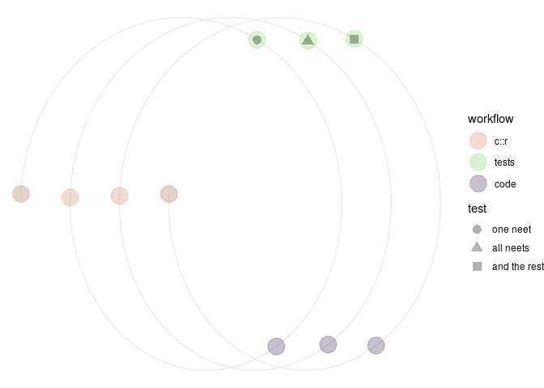
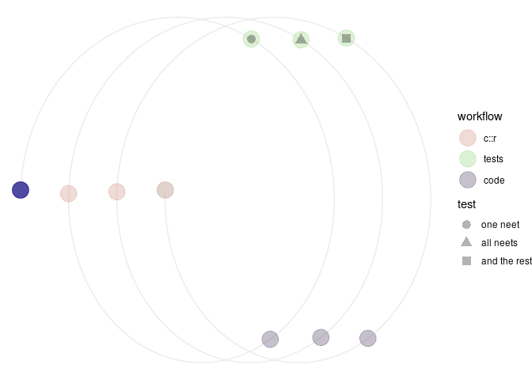
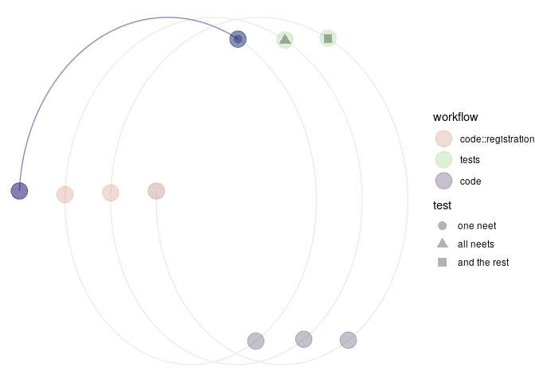
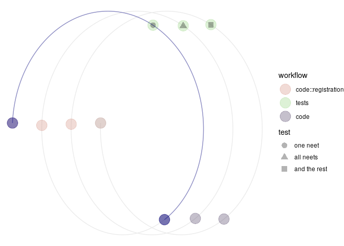
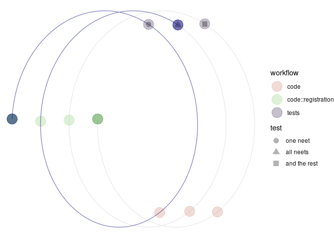
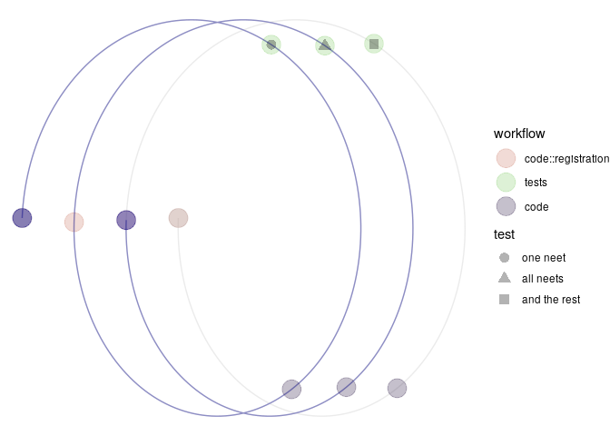
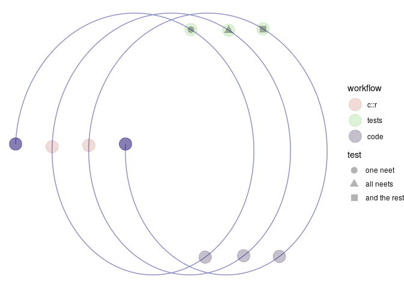

<!-- README.md is generated from README.Rmd. Please edit that file -->

<!-- badges: start -->

[](https://travis-ci.org/softloud/neet)
<!-- badges: end -->

# `neet::` Test for non-empty thing of expected type

A *neet test* tests for **non-empty** thing of **expected type**. This
is what is referred to as a *boundary condition* test in RStudio’s
primers (todo: citation).

These expectations are intended to integrate into minimal testing
workflow *for development* of data analyses. When developing a function,
we will need parameters, and structure of the pipeline. These tests
enable the developer to feel reassured the pipeline’s functions are
outputting non-empty thing of expected type, while the developer decides
the best structure for an analysis pipeline.

A `character` string will be checked for being of string-length \> 1.

A `numeric` is checked for not being `NA`, `NULL`, `Inf`, or `-Inf`.

A \`list\`\` is checked for being of length \> 1.

A `data.frame` is checked for having at least one row.

A `ggplot` object is checked for successfully running.

# Installation

You can install the released version of `neet` from GitHub with:

``` r
# install devtools
install.packages(devtools) 

# use devtools to install package from github
devtools::install_github("softloud/neet")
```

## Example

This is a basic example which shows you how to solve a common problem:

``` r
library(testthat)
library(neet)

## basic example code

# assertions check inputs of code in function scripts
assert_neet(3, "numeric") # test numeric
#> [1] TRUE
assert_neet("cat", "character") # test character string
#> [1] TRUE
assert_neet(mtcars, "data.frame") # test data frame
#> [1] TRUE

# expectations check output of code in testthat files
expect_neet(3, "numeric") # test numeric
expect_neet("cat", "character") # test character string
expect_neet(mtcars, "data.frame") # test data frame
```

# Workflow

The `neet::` package supports a coding workflow.

``` r
workflow(0)
```



This section describes the test-driven workflow presented above as a
`code::proof`ed coding to doneness.

The model workflow comprises three stages, repeated three times, before
returning to the start, the `code::registration`. We use *model* to
suggest the workflow may be adapted for different use-cases.

Each phase consists of:

1.  `code::registration`
2.  tests
3.  code

## coding to `code::proof` workflow

The tests vary each time in complexity, so that the complete model cycle
consists of ten phases of work:

1.  `code::registration`

<!-- end list -->

``` r
workflow(1)
```



In an issue on GitHub:

1.  Describe the algorithm’s intended purpose.
2.  Describe the input parameters and how they will be tested.
3.  Describe the output parameters and how they will be tested.

## purpose

A `duck` that `"quack"`s.

## input

Nothing.

## output

  - [ ] one neet
  - [ ] all neets
  - [ ] and the rest

Character string “quack”.

2.  `neet` tests, one per function

<!-- end list -->

``` r
workflow(2)
```



Write a test to check the duck quacks at all. This test currently fails,
because I have not written the code to make it pass, yet.

``` r
test_that(expect_match(duck(), "quack"))
#> Error in duck(): could not find function "duck"
```

3.  code

<!-- end list -->

``` r
workflow(3)
```



Write code to make the test pass.

``` r
# write function
duck <- function() {"quack!"}
```

And now no error message is returned.

``` r
test_that(expect_match(duck(), "quack"))
#> Error in duck(): could not find function "duck"
```

4.  `code::registration`

Either update or rewrite the `code::registration`. It becomes more
obvious what code needs to be written once the developer has spent some
time again with the function.

  - [x] one neet
  - [ ] all neets
  - [ ] and the rest

<!-- end list -->

5.  `neet` tests, for all inputs for each function

<!-- end list -->

``` r
workflow(5)
```



Now consider all inputs. Since we have nothing, we might consider the
case where there is something, and write a test that expects an error.

``` r
test_that("function fails with input", {
  expect_error(duck(3))
})
```

6.  code

The duck quacks sufficiently. No more code required\!

7.  `code::registration`

<!-- end list -->

``` r
workflow(7)
```



Either update or rewrite the `code::registration`.

  - [x] one neet
  - [x] all neets
  - [ ] and the rest

<!-- end list -->

8.  tests, and the rest, i.e., any other cases to test for

I am satisified with the test coverage.

9.  code

The duck quacks sufficiently.

7.  `code::registration`

<!-- end list -->

``` r
workflow(10)
```



  - [x] one neet
  - [x] all neets
  - [x] and the rest

For the final `code::registration`, update the document for your future
self with details you may need when implementing new features.
