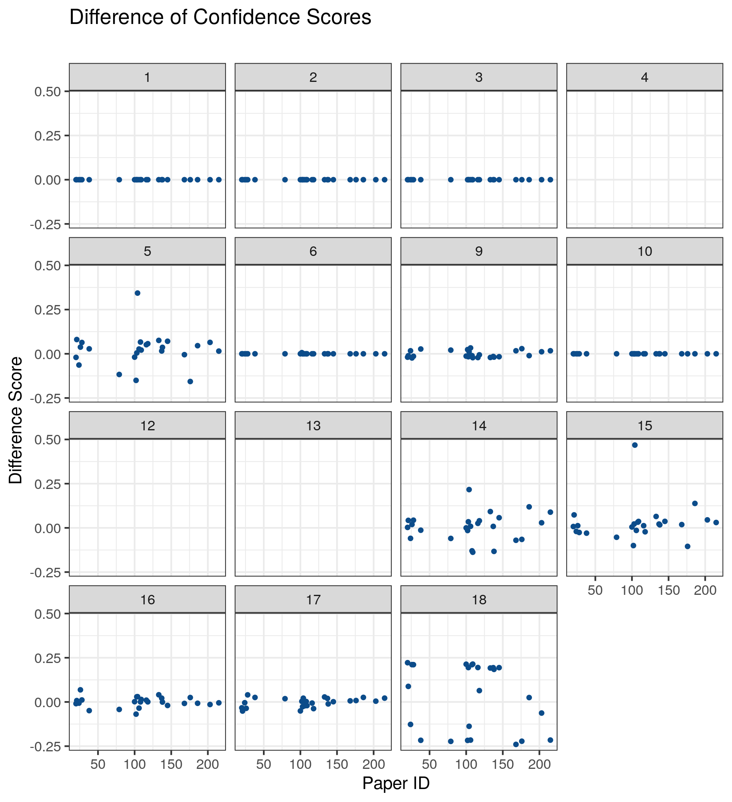

```{r setup, include=FALSE}
knitr::opts_chunk$set(echo = TRUE,
                      fig.height = 2.3,
                      fig.width = 5,
                      fig.align = "center",
                      message=FALSE)

library(tufte)
library(ggplot2)

# David's affiliation
# Quantitative and Applied Ecology Group, School of BioSciences, University of Melbourne. And orcID: 0000-0002-9560-6499
```

[^1]: Special thanks to Emily Riederer for her ongoing correspondence throughout the writing of this manuscript. Thanks, also, to Hannah Fraser, Fiona Fidler, and Daniel Fryer. Also, appreciation for Danielle Navarro, Thomas Pedersen and others on twitter who helped with the visualisation. 


# Coding to `code::proof` 

J. S. Bach's Contrapunctus I, a four-part [^3] work of counterpoint from *The Art of Fugue* [@bach_artfuguebach_2005], is not learnt in one sitting. Indeed, for most pianists, to play the three-minute piece is the result of many months' diligent work, and still the piece will never feel *done*. To play well, a pianist must employ technique, but *how* a pianist is to achieve the desired technique is not clear [@chang_fundamentalspianopractice_2009a].  

[^3]: A **part** denotes a melodic voice in music theory; these **polyphonic** pieces comprise melodies that are played at the same time, creating harmonies. Many would have encountered this in early schooling, singing rounds in the classroom, where singers are staggered in starting.

For a researcher performing an analysis using a computational tool such as R, it can be unclear when an analysis is *done*. And, while there are technical guides on *good enough* practice, which is to say, what we might reasonably request of a researcher developer [@wilson_good_2017], it can feel overwhelming as to what to adopt and where. Particularly for an in-development algorithm, which is to say, an algorithm with scripts already started, and some results explored. Given the evolutionary nature of research conceptualistion, this is often the case for the beginning of a scientific project intended for publication.

This manuscript picks up from where Riederer left off with **RMarkdown-driven development** and suggests a  `code::register`ed (`c::r`ed[^2]) **test-driven workflow** for coding to doneness. This workflow provides a roadmap to completion for a packaged analysis with `code::proof` [@grayCodeProofPrepare2019], a measure of confidence in the implementation of the algorithm.   

[^2]: In this manuscript, `c::r` denotes `code::registration`, `c::r`ing denotes `code::registering`, and `c::r`ed denotes `code::registered` 

Musicians and, similarly, athletes, do not see themselves as having mastered a skill, but as active practitioners of a craft [@galway_flute_1990]. To be a flautist is to practice, and to be an athlete is to train. For researcher developers, it can be hard to assess when an analysis is completed. In this manuscript, we consider the *practice* of test-driven analysis development as a means of achieving trustworthy-enough `code::proof` in an algorithm,  confidence in the implementation of the algorithm [@grayCodeProofPrepare2019]. 

## Questionable research practices in scientific computing

Algorithms are coded by people who *practice* code, and significant problems emerge when algorithms are treated as fixed artifacts, rather than one of the tools utilised by those who practice code. In Australia, a heartbreaking, ongoing example of this kind of problem is the income-reporting data analysis algorithm that assesses if income welfare recipients have been overpaid entitlements. Crude averaging calculations have lead to ongoing incorrect debt notices issued, such as 20,000 people receiving automatically-generated `robodebt' notices for debts they did not owe [@mcilroy201720]. Problems in data analysis have real impacts on real people's lives. Perhaps, if the algorithm were considered a workflow practiced and monitored by a team of data scientists, rather than a static object, problems would not be persisting to this day [@karp_robodebtfederalcourt_2019]. Indeed, as noted in Wilson's testing primers (in development) for [RStudio](https://rstudio.cloud/learn/primers) [@_rstudiocloud_], 

> Almost all (92%) of the catastrophic system failures are the result of incorrect handling of non-fatal errors explicitly signalled in software. In 58% of the catastrophic failures, the underlying faults could easily have been detected through simple testing of error handling code [@yuan_simpletestingcan_2014].

We might view this as a computational instantiation of what Fraser *et al.* denote *questionable research practices* (QRPs). The QRPs Fraser *et al.* provide a taxonomy for refer to various practices in scientific methodology found in ecology and evolution, such as $p$-hacking, adjusting a model's specification to achieve a desired $p$-value, or *cherry picking*, failing to report variables or results that do not fit a desired narrative. QRPs are, importantly, often not a result of scientific malpractice, but a question of discipline-specific conventions established in bygone eras not translating well to data-driven research [@fraser_questionable_2018]. In scientific computing, as the robodebt example illustrates, similar and overlapping errors may occur. 

A consideration when providing recommendations of best practice is what we might reasonably expect of a researcher. Indeed, it is likely unrealistic to expect *best practices* in scientific computing [@wilson_best_2014], perhaps we would be better off asking for *good enough* practices [@wilson_good_2017] in scientific computing. For while researchers use computational algorithms in science every day, most of them are not trained in computational science. Even mathematicians and statisticians do a great deal of training at the blackboard, rather than the computer.    

Riederer identifies several QRPs in scientific computing, for example, hardcoded values that interfere with another's ability to reproduce the computational results [@riederer_rmarkdowndrivendevelopment_2019]. As researcher software engineers, it behoves us to consider what are questionable research practices in software produced for data analyses. Version control and open code sharing via a platform such as GitHub, is one way to mitigate questionable research practices in scientific computing [@Bryan2017ExcuseMD]. There is also a growing literature on reproducible research compendia via packaged analyses [@marwick_packaging_2018; @wilson_good_2017].     

This manuscript contributes to this literature by focussing on workflows for using automated tests to move analysis towards a fully reproducible packaged research compendium. Furthermore, these workflows assist the developer to communicate what they have coded to others and their future self, as a means of mitigating questionable research practices in scientific computing. Above all, by providing a workflow for the *practice* of code, the developer anxiety is reduced by having the parameters as clearly defined as they can be from the start.

## Practice fundamentals

Chuang C. Chang's _Fundamentals of Piano Practice_ sets out to address a gap in piano pedagogy [@chang_fundamentalspianopractice_2009a], not in what defines different levels of pianistic technique, which is abundant, but the scarce-found process of obtaining said technique. Chang differentiates between piano _performance_, the desired end product, and _practice_, a daily task experienced alone by the pianist with the purpose of achieving the technical requirements of performing the work. For a pianist, solo practice dominates their experience of the instrument, but this may not be immediately evident when one only encounters the pianist before an audience of three thousand in a concert hall. Whilst abundant guidance exists as to the technical demands of the performance, the desired end product, Chang aims to address how the pianist spents the vast majority of their time at the piano: practice. Technical works provide guidance as to optimal end-product and provide incrementally more difficult pieces towards the process of achieving the end product. The end product, in piano, is a performance, in computation, software; the process for piano is known as practice, and for software, coding.       
The technique required, the end product, is analogous to prioritising the end-user's experience of computational data analysis tools. Researcher developers' domain is not merely computer science, but, increasingly, the humanities, social science and biomedical research [@statrethinkingbook]. Thus, for computational science, there is a need for reflection not on the end-user's experience, but on the researcher developer themselves. For if good enough practice is too daunting, too time consuming, the reseacher, juggling teaching loads, global upheavals, and technological revolutions, may simply accept failure and revert to conventional, if questionable, research practices [@fraser_questionable_2018; @wilson_good_2017].  

The objective of scientific computation is different from advanced pianism, but we may characterise testing *practice*, as opposed to coding *technique*, analogous to how Chang delineates between *pianistic* practice and technique. Through attempting to identify the fundamentals of automated testing for collaborative data analysis development, this manuscript aims to articulate the gap in understanding automated testing implementation for analysts. We begin, as is perfectly natural, with a rumination on canonical literature of piano technqiue, before examining the parallels in the guidance of good enough practices in scientific computation. 

There are many texts of pianistic technique students of the instrument are like to be familiar with. Bach provides a pathway from small canons [@bach_childrenbachmusic_1933], to two-part inventions and three-part sinfonia [@bach_twothreepart_1968], and the challenge of *The Well-Tempered Clavier* [@bach_welltemperedclaviermusic_2006] and *The Art of Fugue* [@bach_artfuguebach_2005]. Bartok provides the *Mikrokosmos: Progressive piano pieces* [@bartok_mikrokosmosmusicprogressive_1940], and one can progress from Carl Czerny's *One Hundred and One Exercises for the Pianoforte* [@czerny_czernyonehundred_1900] to his *School of Velocity* [@czerny_schoolvelocityop_1900], for studies (more often referred to in French as etude) that target different aspects of technique, such as staccato, legato, slurring, (clipped or smooth), and dynamics, (loud or soft). In each case, technical exercises of increasing difficulty are provided. In piano pedagogy, a _technical_ exercise, an etude, isolates a particular aspect of pianistic technique [todo examples]. For example, [todo Czerny staccato]. Or, [todo voicing technique].

The dearth that Chang attempts to address is in pianistic _practice_ habits that will lead to successful adoption of these techniques. In computational science, we might call this a _workflow_. 

> .. practically every piano learning method consists of showing students what to practice, and what kinds of techniques (runs, arpeggios, legato, staccato, trills, etc.) are needed. There are few instructions on how to practice in order to be able to play them, which is mostly left to the student and endless repetitions [@chang_fundamentalspianopractice_2009a].

Wilson *et al.* followed their work on _best practices_ in scientific computing [@wilson_best_2014], with a reflection on _good enough_ practices [@wilson_good_2017], in recognition that we must account for what we might reasonably request of data analysis practitioners. In this manuscript, we consider one component of *good enough* practice in data analysis: **automated testing**.  

Automated tests are a formalised way of implementing checks that inputs and outputs of algorithms are as expected [@wickham_r_2015]. Informative messages are output that assist the developer in identifying where code is not performing as expected. Not only does this conform to good enough practices in scientific computing, but test-driven development provides a collaborative framework for the *practice* of coding to a measure of `code::proof`.

## Collaboration via automated testing 

At heart, automated tests are collaborative. This may be with others, but applies at least as much to an analyst approaching their own past work with which they have become unfamiliar, or have become anxious about some aspect of their work. Automated tests provide an efficient way of returning to and extending an analysis; anxiety is reduced by having defined outcomes to explicitly code for. 

Reproducible research compendia provide a means by which analysts can share their work so that it may be extended by others, and automated tests provide `code::proof` [@grayCodeProofPrepare2019], a measure of confidence in the algorithm for others. Hayes expresses concern about using algorithms published without automated tests [@hayes_testing_2019]. However, only one quarter of the largest repository of R packages, [The Comprehensive R Archive Network](https://cran.r-project.org/), have any automated tests [@hester_covr_2016], highlighting that, despite testing being identified as a 'vital' part of data analysis [@wickham_r_2015], automated testing is yet to be widely adopted.

# A toolchain walkthrough for test-driven analysis workflow 

From this section, we now consider the practicality of implementing tests through a **toolchain walkthrough**, an opinionated documentation of a scientific workflow, towards a measure of `code::proof`, confidence in the algorithm implementation [@grayCodeProofPrepare2019]. In particular, a toolchain walkthrough is a reflection of *one* workflow, using specific tools. This is in contrast to a comprehensive review of tools and approaches. Instead, a toolchain walkthrough ruminates on considerations *given* a set of tools and an approach.

Toolchain walkthroughs aim to identify obstacles and advantages in implementation of scientific workflows. By necessity, a toolchain walkthrough is language specific, but, ideally, observations emerge that are useful for any appropriate language employed for data analysis, such as Python. This toolchain walkthrough examines the *process*, analogous to piano *practice*, of implementing tests, as opposed to defining comprehensively the nature of *good enough* tests, analogous to guidance on pianistic technique.

## Objective of this toolchain walkthrough

This toolchain walkthrough aims to provide guidance on implementing a test-driven workflow for an in-development analysis. Many analyses begin as scripts that do many things that evolve into an organised set of testable documented functions  [@riederer_rmarkdowndrivendevelopment_2019]. The central question of this manuscript is what constitutes a minimal level of testing for in-development analysis, where code is still being written and features implemented. Automated tests assist in time-consuming debugging tasks [@wickham_r_2015], but also in providing information for a developer who is unfamiliar with the code (including new users *and* existing developers returning after some level of temporal distancing). 

This is a first effort in identifying the fundamentals of automated testing for the collaborative process of developing an analysis in R. Analogous to Riederer's *RMarkdown-driven development* [@riederer_rmarkdowndrivendevelopment_2019], which de-constructs the workflow of developing an analysis from .Rmd notebook-style reports to packaged analyses, we consider a set a computational tools that form a workflow to assist in the coherent development of automated tests for data analysis. This is an extension of the workflow suggestions provided in *R Packages*, with a specific focus on collaborative workflows in research.   

## Devops and assumed expertise

This toolchain walkthrough assumes a knowledge of R advanced enough to be using the language to answer scientific research claims. The explict examples are given using the R programming language, however, the workflow described could be adapted to any language and any number of tools.

Assumed level is researcher developers who are not primarily computer scientists, but whose domains are in ecology, social science, medical science, etc. A working understanding of R is assumed, as described in texts such as *R Cookbook* [@longCookbook2ndEdition2019] or *Learning Statistics with R* [@navarro_learningstatistics_2019] as is a little familiarity with testing, as described in the Testing chapter of *R Packages* [@wickham_r_2015]. 

Another assumption is that the code is shared openly via a repository hosting serevice, such as [GitHub](https://github.com/), where subprojects, in this case, **issues**, can be tracked. 

## Case study packaged analyses 

This toolchain walkthrough for `c::r` reflects on the in-development practice of code to completion on several different research projects. Consideration of sufficient `code::proof` of packages `varameta::` and `simeta::`, developed for the oeuvre of doctoral work this manuscript contributes to. Another example project is considered, The repliCATS Project software of statistical aggregation methods, in particular `CATnap::` and `aggreCAT::`. 

For The repliCATS Project, the algorithms are not available until the research is complete, in order to blind the other team to the methodology. Although we cannot provide explicit code examples, the process is considered with respect to this project, as it is an example of collaborative in-development `c::r`.

The `varameta::` and `simeta::` packages are being devloped for a compartive analysis of estimators for meta-analysis of medians. The `varameta::` package provides computational implmentation of existing methods, as well as a new approach, and the `simeta::` package provides tools for simulations that mimic meta-anlaytic data. 

# `neet::` tests

The workflow described in this toolchain walkthrough differentiates explicitly between code that produces a **non-empty** thing of **expected type** (**neet**), for example, a logical, character string, or numeric, and the other expectations one has of the output, that is *correct*, works for any given input, errors on input it should, and so forth. To support this workfow, the `neet::` package provides three components:

1. `::test_neet` for testing outputs.
2. `::assert_neet` for checking inputs.
3. `::workflow` for diagrammatically indicating stage of codeflow.

A **neet test** checks a function outputs a **non-empty** thing of **expected type**. This is what is referred to as a **boundary condition** test in RStudio's primers [@wilson_rstudiocloud_2018].

These expectations are intended to integrate into minimal testing workflow
for the *development* of data analyses. When developing a function, we will need parameters, and structure of the pipeline. These tests
enable the developer to feel reassured the pipeline's functions are
outputting non-empty things of expected type, while the developer decides the best structure for an analysis pipeline. 

A `character` string will be checked for being of string-length > 1.

A `numeric` is checked for not being `NA`, `NULL`, `Inf`, or `-Inf`.

A `list`` is checked for being of length > 1.

A `data.frame` is checked for having at least one row.

## Installation

You can install the released version of `neet` from GitHub with:

``` {r eval=FALSE}
# Install devtools
install.packages(devtools) 

# Install dependencies
install.packages("assertthat")
install.packages("testthat")
install.package("ggplot")

# Use devtools to install package from GitHub
devtools::install_github("softloud/neet")
```

```{r}
# load the neet:: package
library(neet)
```

The `neet::` package extends on `testthat::` and `assertthat::` infrastructure, to provide workflow-specific tools for the first two phases of codeflow. `neet::` tests can be performed on both inputs and outputs.

## Inputs

Assertions are checks on inputs for a function. 

```{r example}
# Assertions check inputs of code in function scripts

# Examples on raw objects
assert_neet(3, "numeric") # test numeric
assert_neet("cat", "character") # test character string
assert_neet(mtcars, "data.frame") # test data frame

```

To illustrate how asserts work in practice, we turn to a toy function that outputs a printed message.

```{r}

# a function that quacks like a duck
quack <- function(times) {
  
  # neet check the input argument
  # multiple asserts may be written for multiple arguments
  assert_neet(times, "numeric")
  
  # operational codeblock of function
  duck_says <- rep("quack", times) %>% 
    paste(collapse = ", ")
  
  output <- paste0("'", duck_says, "', said the duck.\n")
  
  cat(output)
  
}

# try out our function
quack(times = 3)

```

This code will provide an informative error if argument for number of `times` the duck should quack is not a number. 

```{r error=TRUE}
# this code will error
quack(times = "i am not a duck")

# this code will also error
quack(times = TRUE)

```

These messages are for the developer; this is for the _practice_ of code, as opposed to the end-user's experience. For this, more informative asserts might be written with more information for user of the package. However, these considerations can be left for the final code cycle, when `and the rest` tests are written. A note might be made to update the `c::r` to address this later in the codeflow. 

## Outputs

These tests are intended as a first step in developing an analysis. These enable the developer to write a single test for each function they intend to write, to check the code flows from one function to the next in the intended type at each step. This is explicitly with debugging in mind, expecting that in-development code will produce unexpected bugs and fail in unexpected places. By modularising the code into packaged functions, each of which do one explicit, documented thing, the researcher can identify where the algorithm fails. 

``` {r }
# Expectations check output of code in testthat files
test_neet(3, "numeric") # test numeric
test_neet("cat", "character") # test character string
test_neet(mtcars, "data.frame") # test data frame

# test the output of a function
# test_neet(quack(2), "character")

```

## Workflow

The `neet::` package also provides a visual representation of where in development notes on an algorithm is. This can be copied to the clipboard and pasted into GitHub issues. 

```{r}
# blank workflow
workflow(0)

# representing progress in workflow
# this displays the fifth step in the workflow
workflow(5)
```


# test-driven workflow to `code::proof`  

This toolchain walkthrough outlines a workflow for coding an analysis to a sense of doneness, which is to say, `code::proof`, a sense of confidence in the implementation of an algorithm. By deciding, and updating, what *done* looks like from the start, the anxiety induced by feature creep, the introduction of ever more complexities, is reduced. We may not think of everything required for analysis, but this is always so. But by `c::r`ing our code, we are at least clear of what has been created for the analysis, rendering the code more transparent and extensible by both the developer themselves, at some future date, or by another researcher. In Figure \@ref(fig:workflow), we see an overview of the test-driven workflow proposed in this manuscript. This function is included in the `neet::` package. 

```{r workflow, message=FALSE,echo=FALSE,fig.cap="This test-driven workflow has ten phases. It begins with a c::r, and then each of the three cycles consists of: tests, code, and update c::r"}
# workflow 0 displays the workflow template
workflow(0)
```

The workflow begins with a `c::r`, an outline of the intended algorithm, its inputs, and outputs. After the initial `c::r`, the workflow comprises three steps, repeated for three cycles, before returning to the start, the `c::r`.

Each cycle consists of:

1. tests
2. code
3. `c::r`

Note that tests precede code; thus the tests are written for functions that are yet to exist. The idea is to write code to make the tests pass. For an example of the difference between `c::r`ed code and ad hoc developed code, we turn to  the `varameta::` package, which comprises estimators for the variance of the sample median.  

In Figure \@ref(fig:codebrainbad), we represent the estimators provided by `varameta::`, as we might think of them as we code. We have an understanding, from the perspective of any given estimator, of the inputs and outputs, but less understanding as to how the estimators relate to each other. 

```{r codebrainbad, echo=FALSE,message=FALSE,fig.height=5,fig.cap="`code::brain` before `c::r`: in the `varameta::` package there are various estimators that take different summary statistics as inputs. This is a visual representation of how we might conceptualise each function; we're aware of what goes in and what comes out, but it is hard to understand how the functions relate to each other."}
library(igraph)

confusing_relationships <- make_graph(~ 
a-+hozo, b-+hozo, m-+hozo, n-+hozo, hozo-+s, hozo-+mean,
a-+wan1, b-+wan1, m-+wan1, n-+wan1, wan1-+s, wan1-+mean,
a-+pren, b-+pren, m-+pren, n-+pren, pren-+s,
q1-+wan3, q3-+wan3, m-+wan3, n-+wan3, wan3-+s, wan3-+s,
q1-+pren, q3-+pren, m-+pren, n-+pren, pren-+s,
a-+wan2, b-+wan2, q1-+wan2, q3-+wan2, m-+wan2, n-+wan2, wan2-+s, wan2-+mean,
a-+bland, b-+bland, q1-+bland, q3-+bland, m-+bland, n-+bland, bland-+s, bland-+mean
           ) 

confusing_relationships %>% plot(
             vertex.color = "grey",
             vertex.frame.color = "darkgrey",
             alpha=0.3,
             vertex.size = 10,
             vertex.label.cex = 0.8,
             edge.arrow.size = 0.4 
             ) +         
  theme(panel.background = element_rect(colour = "#ffffe0"),
        plot.background = element_rect(colour = "#ffffe0")) 


```

However, if we `c::r` our analysis, we are forced to identify the inputs and outputs for each function. This enables us to have a clearer understanding of where code should be shared, and how the functions relate to each other.

```{r echo=FALSE}
library(ggraph)
library(tidygraph)
library(tidyverse)

  nodes <- tribble(
  ~node, ~state,
  "a", "input",
  "b", "input",
  "q1", "input",
  "q3", "input",
    "m", "input",
  "n","input",
  "hozo", "estimator",
  "pren_c3", "estimator",
  "pren_c1", "estimator",
  "bland", "estimator",
  "wan_c1", "estimator",
  "wan_c2", "estimator",
  "wan_c3", "estimator",
  "se_median", "output",
  "mean", "output",
  "sd", "output",
  "g_cauchy_c1", "estimator",
  "g_cauchy_c3", "estimator",
  "g_exp_c1", "estimator",
  "g_exp_c3", "estimator",
  "g_norm_c1", "estimator",
  "g_norm_c3", "estimator",
  "g_lnorm_c1", "estimator",
  "g_lnorm_c3", "estimator"
) %>% 
  mutate(state = fct_relevel(state, "input"))

edges <- tribble(
  ~from, ~to,
  # hozo estimator
  5,7, 
  6,7,
  1,7,
  2,7,
  7,15,
  7,16,

  # wan1 estimator
  5,11, 
  6,11,
  1,11,
  2,11,
  11,15,
  11,16,
  
  # pren1 estimator
  5,9, 
  6,9,
  1,9,
  2,9,
  9,14,
  
  # bland estimator
  5,10,
  6,10,
  1,10,
  2,10,
  3,10,
  4,10,
  10,15,
  10,16,
  
  # wan2 estimator
  5,12,
  6,12,
  1,12,
  2,12,
  3,12,
  4,12,
  12,15,
  12,16,

  # wan3 estimator
  5,13, 
  6,13,
  3,13,
  4,13,
  13,15,
  13,16,

  # pren3
  5,8, 
  6,8,
  3,8,
  4,8,
  8,14,

  # g_cauchy_c1
  5,17, 
  6,17,
  1,17,
  2,17,
  17,14,
  
  # g_cauchy_c3
  5,18, 
  6,18,
  3,18,
  4,18,
  18,14,

  # g_exp_c1
  5,19, 
  6,19,
  1,19,
  2,19,
  19,14,
  
  # g_exp_c3
  5,20, 
  6,20,
  3,20,
  4,20,
  20,14,

  # g_norm_c1
  5,21, 
  6,21,
  1,21,
  2,21,
  21,14,
  
  # g_norm_c3
  5,22, 
  6,22,
  3,22,
  4,22,
  22,14,
  
  # g_lnorm_c1
  5,23, 
  6,23,
  1,23,
  2,23,
  23,14,
  
  # g_lnorm_c3
  5,24, 
  6,24,
  3,24,
  4,24,
  24,14
)
```


```{r codebraingood, echo=FALSE, fig.cap="code::brain after `c::r`: by outlining the outputs and inputs, we have a clearer understanding of the codeflow of the package. We can see the inputs vary, but overlap, as do the outputs.", fig.width=5, fig.height=5}


tbl_graph(nodes, edges) %>% 
  mutate(state = fct_relevel(state, "output")) %>% 
  ggraph() +
  geom_edge_link(arrow = arrow(), colour = "lightgrey") + 
  geom_node_label(aes(label = node, colour = state),
                  fill = "lightgrey",
                  size = 2.5) +
  theme_graph() +
  hrbrthemes::scale_color_ipsum() +
  theme(legend.position = "none",
        panel.background = element_rect(colour = "#ffffe0"),
        plot.background = element_rect(colour = "#ffffe0")) + 
  scale_y_reverse() + 
  coord_flip()

```


```{r}

```


## `code::proof` workflow for coding to doneness

The tests vary each time in complexity, so that the complete model cycle consists of ten phases of work:

1. `c::r`

First cycle:

2. neet tests, one per function
3. code
4. `c::r`

Second cycle:

5. neet tests, for all inputs for each function
6. code
7. `c::r`

Third cycle:

8. tests, and the rest, i.e., any other cases to test for
9. code
7. `c::r`

However, this workflow may be adapted for different use-cases, with more or less cycles, depending on the complexity of the algorithm. Thus, we will consider this a model workflow designed with not the intent of blind adherence, but to contribute to ruminations in computational metaresearch. The following section steps through each phase of work, comparing and contrasting across the example analyses.

## Coding to `code::proof` toolchain walkthrough

In this section we step through the Coding to `code::proof` for...

- `varameta::`, an in-development analysis that has seen many iterations.  
- `simeta::`
- `repliCATS`

# `code::registration` (`c::r`)

```{r, message=FALSE,echo=FALSE}
neet::workflow(1)
```

We begin with a sketch outline of a `code::registration` (`c::r`), which we then populate with description in prose, provide some detail of neet testing, before discussing how this differed across our example packaged analyses, `aggreCAT::`, `simeta::`, and `varmeta::`.

As our first testing objective is one neet test per function, we need not necessarily work out the details of all possible things to check for, as we will update `c::r` three more times. We simply ask, what will it take to check that each function required for the algorithm produces a non-empty thing of expected type? For the second `code::proof` cycle, we consider all possible inputs, and write tests, and then code for those. 

The final phase, which we need not detail immediately, covers testing for anything else we may wish to check. This might be checking there are positive numbers output by the function. Or it might be rigorously checking that the algorithm matches the output of another person's instantiation of the algorithm, as is the case with the `aggreCAT::` package. The following template provides a guide for `c::r`ing an analysis[^4].

```

1. Objective:

2. Inputs:

- [ ] one neet
- [ ] all neets
- [ ] and the rest

3. Outputs:

- [ ] one neet
- [ ] all neets
- [ ] and the rest

```

[^4]: Note that `- [ ]` will create an unchecked tickbox and `- [x]` will create a tickbox in both GitHub and RMarkdown.

## `varameta:: c::r`

```{r}
neet::workflow(1)
```

The `varameta::` package has the least complex structure of the examples we are considering. This is the intiial `c::r`.

**Objective**

The `varameta::` package aims to provide a collection of different estimators for approximating the variance of the sample median.  

**Inputs**

Each estimator takes various sample statistics (quartiles, etc.), sample size.

- [ ] one neet
- [ ] all neets
- [ ] and the rest

**Outputs**

Each estimator outputs an estimate of spread and centre. Some are approximations of the variance of the sample median, and others approximate the standard deviation and mean.

- [ ] one neet
- [ ] all neets
- [ ] and the rest

## Considerations in `c::r`

The objective of the `simeta::` package is twofold, and will be implemented in two phases, but there is no reason we cannot explicitly state this in the `c::r`, which is deliberately broad to allow various use-cases.   

**Objective:**

Randomly generate meta-analysis data, calculate a confidence interval based on a user-specified estimator (currently only works on `varameta::`), and evaluates if the true parameter falls within; repeat this |trials| number of times, and return the coverage, the proportion of times the true parameter falls within the confidence interval. 

Summarise and provide a dataframe of coverage for different sample sizes, group effect ratios, variability between studies, and distributions. Also provide summary visualisation tools. 

- [ ] Initial objective: provide analysis support for the meta-analysis of medians paper. 

- [ ] Secondary objective: allow the user to specify the estimator. 

As the  `aggreCAT::` package forms part of a pipeline of packages designed to build a continuously integrated analysis for living data, there are more detailed supplementary materials detailing requirements for inputs and outputs to turn to, thus the `c::r` is somewhat brief on first pass. Being a collaborative project with multiple developers it useful to have a clear statement of the objectives of the analysis to prevent feature creep, that is, the introduction of complexities that do not further the intention of the analysis.  

**Objective**

Provide export-ready data for each of the 19 aggregation functions.

**Inputs**

Expert judgements to be aggregated. Some special functions take other supplementary datasets, too.

**Outputs**

A wrapper function outputs each dataset in wide client-ready format. 

# First cycle: one `neet` test per function 

For the first `code::proof` cycle, we follow the steps:

1. Write one `neet` test per function.
2. Write code to make those `neet` tests pass, for each function.
3. Update `c::r`.

If functions are already written, then we only need to _confirm_ the functions pass the `neet` tests.  


In the following code snippets, we provide some of the `neet` tests associated with the `aggreCAT::` package. 

```{r eval=FALSE}
context("neet:: - non-empty thing of expected type")

library(neet)

```

These tests check that a dataframe is produced from raw data, `expert_judgements`, passed into various aggregation methods. The methods have been replaced with `method_n`, as a condition of this research is to keep the other teams blinded to the aggregation calculations. Once the project is completed, the software and analyses will be open source. 


```{r oneneet, eval=FALSE}
# wrapper -----------------------------------------------------------------

test_neet(aggregate_cs(expert_judgements), "data.frame")

# methods -----------------------------------------------------------------

# the methods are masked to preserve blinding between research teams 
# in this ongoing project
test_neet(method_1(expert_judgements), "data.frame")
test_neet(method_2(expert_judgements), "data.frame")
test_neet(method_3(expert_judgements), "data.frame")

...

```

The `varameta::` package has a similar structure to the `aggreCAT::` package, in providing estimators for a particular statistical purpose. 

> todo: provide example

The `simeta::` package has several distinct moving parts. 

> todo: provide example


# Second `code::proof` cycle: all neets

One `neet` confirms the function runs on one input. All `neet`s is for confirming the functions run on all possible inputs. In the `aggreCAT::` package, there is very little variation on inputs for the functions, so the single `neet`s effectively cover all `neet`s. In `varameta::`, the different cases are handled by different functions, with the exception of `::effect_se`, which handles various inputs, and performs different calculations for each. For `simeta::` this is considerably more involved. 

## All `neet`s for `varameta::effect_se`

## Testing functions as input for `simeta::metasims`

# Third `code::proof` cycle: and the rest

Now that we have neet tests for each function, we ask what else needs to be tested. The neet tests provide a framework to consolidate the structure of the algorithm, and now the programmer can apply additional robustness to tests to ensure the output is the desired output of each function. In this section, we outline different things to consider for automated tests, as well as tools, `covr::`, for what code is tested, and Travis, for integrated testing, to ensure future `code::proof` as features are developed. 

In the case of `varameta::`, we might calculate a fixed-value output and compare it, but calculations rapidly become too complex to calculate explicitly. 

In the case of `aggreCAT::` for the repliCATS Project, we have several aggregation methods to compare. In a large-scale collaborative project such as this, we have several different researchers contributing methods which the Reproducibility Team are engineering as open-source research software. In this case, the algorithms are being computationally implemented in software by different researchers than those who conducted the initial analyses. And that means, with a bit of collating, we have access to many testing datasets.

All packages benefit from the use of tools such as `covr::` and Travis. 

## Testing via explicit calculations in `varameta::`

```{r eval=FALSE}
context("estimators")

library(varameta)

# test numbers

big_negative_number <- runif(3,-100,-1.1)
small_negative_number <- runif(3,-0.9,-0.1)
big_positive_number <- runif(3, 1.1, 100) %>% round()
small_positive_number <- runif(3, 0.1, 0.9)

# generate testing sample for different sample sizes
ts <-
  c(
    sample(seq(5, 15), 1) %>% as.numeric(),
    # some estimators are case-wise defined
    sample(seq(16, 70), 1) %>% as.numeric(),
    sample(seq(70, 100), 1) %>% as.numeric()
  ) %>%
  purrr::map(runif) %>% # sample some uninteresting data
  {
    # calculate summary statistics
    tibble::tibble(
      min = purrr::map_dbl(., min),
      max = purrr::map_dbl(., max),
      first_q = purrr::map_dbl(., quantile, probs = 0.25),
      third_q = purrr::map_dbl(., quantile, probs = 0.75),
      iqr = purrr::map_dbl(., IQR),
      mean = purrr::map_dbl(., mean),
      median = purrr::map_dbl(., median),
      sd = purrr::map_dbl(., sd),
      n = purrr::map_dbl(., length)
    )
  } %>% # calculate estimators and worked examples
  dplyr::mutate(
    # effect_se_iqr = purrr::pmap_dbl(list(centre = median, spread = iqr, n = n),
    #                          .f = varameta::effect_se,
    #                          centre_type = "median",
    #                          spread_type = "iqr"),
    hozo_mean = purrr::pmap_dbl(list(
      a = min,
      m = median,
      b = max
    ), hozo_mean),
    hozo_mean_wkd = (min + 2 * median + max) / 4,
    hozo_se = purrr::pmap_dbl(list(
      a = min,
      m = median,
      b = max,
      n = n
    ), hozo_se), 
    hozo_se_wkd_case1 = sqrt(((max - min) ^ 2 +
                                (min - 2 * median + max) ^ 2 / 4) / 12) /
      sqrt(n),
    hozo_se_wkd_case2 = ((max - min) / 4) / sqrt(n),
    hozo_se_wkd_case3 = ((max - min) / 6) / sqrt(n),
    bland_mean = purrr::pmap_dbl(
      list(
        a =  min,
        q_1 = first_q,
        m = median,
        q_3 = third_q,
        b = max
      ),
      bland_mean
    ),    
    ...
```

## Analysis comparison in `aggreCAT::`

A luxury afforded in a large-scale collaborative research, such as The RepliCATS Project, is that the software is implemented by different analysts than those who developed the statistical algorithms. Different analysts developed different algorithms, and thus, when the research software engineers on the Reproducibility Team came to implement the algorithms there is a wealth of pre-existing analyses to benchmark the software against.

For a small-scale analysis, the method and implementation are often developed by one person, with minimal hands-on input from others, as is the case with the `simeta::` and `varameta::` packages also discussed. However, when the development and implementation are divided between people, an opportunity for quality assurance presents itself. 

This is analogous to the quality assurance for data entry suggested by Yenni *et al.* [@yenni_developingmoderndata_2019]. To update a living data set, collected in the field, the authors suggest two researchers perform the data entry into different spreadsheets, which are then put through text comparison algorithms to identify typos and inconsistencies.

In the case of `aggreCAT::`, there are nineteen aggregation methods, each of which has been contributed by a researcher. Thus, each researcher who developed a method has provided a testing dataset for the Reproducibility Team to compare the results of the software implementing the aggregation methods. 
In Figure \@ref(fig:aggregators), we present the results of in-development tests on the aggregation methods developed for The RepliCATS project.

```{r aggregators, fig.cap="\\label{aggregators} After neet tests are written, a comparison of aggregation methods with other researchers' analyses. Methods such as 1,6, 10, are in close agreement. There are some methods that are relatively close, such as 9 and 17. These may be deemed close enough, in consultation with the researchers who developed the methods. Then there are methods to investigate, such as 18 and 16, where there is variability between the two analyses. The aggregation methods are deidentified and the code for this visualisation will not be available until the repliCATS Project is complete, to blind the other research teams on the SCORE Program to the methods used for analysis."}


```

## Test coverage with `covr::`

The `covr::` function, `::package_coverage`, provides the percentage of the lines of code run in tests and is a succinct method to get an at-a-glance sense coverage of testing scripts. But this assumes we have considered everything that might require testing. Whilst this is informative, it's not comprehensive. A `100%` in all functions in `covr::`, is informative, but is not done.  

Consider a function that takes a number $x$, and outputs $2\log(x)$. To demonstrate this we make a toy package `testtest::` comprising this single function.

```{r}
logfn <- function(x) {
  2 * log(x)
}

```

Now, we write a test that checks the function returns a numeric.

```{r}
library(testthat)

test_that("function returns numeric", {
  expect_is(logfn(3), "numeric")
})
```

And if we run `covr::package_coverage`, we get `100%` for overall package coverage.

```{r, eval=FALSE}
testtest Coverage: 100.00%
R/logfn.R: 100.00%
```

But if we were to add this test, for negative numbers. 

```{r error=TRUE}
test_that("log function works", {
  expect_is(logfn(-1), "numeric")
})

```

Then `covr::package_coverage` fails.

```{r eval=FALSE}
── 1. Failure: log function works (@test-logfn.R#10)  ──────────────────────────
any(is.na(thing_to_test)) isn't false.

── 2. Failure: log function works (@test-logfn.R#10)  ──────────────────────────
any(abs(as.numeric(thing_to_test)) == Inf) isn't false.

══ testthat results  ═══════════════════════════════════════════════════════════
[ OK: 8 | SKIPPED: 0 | WARNINGS: 1 | FAILED: 2 ]
1. Failure: log function works (@test-logfn.R#10) 
2. Failure: log function works (@test-logfn.R#10) 

Error: testthat unit tests failed
Execution halted
```

## Integrated testing with Travis


## `c::r` of doneness

```{r}
workflow(10)
```

Under this workflow, the `c::r` is the project overview any developer can return to. So, this final registration not only summarises what has been tested, but also notes any idiosyncrasies for other developers, _especially_ the future self of the developer who recalls so little of the code they may as well be a different developer.

At this point, the developer makes a final assessment of whether the stated objective of the implementation of the algorithm has been reached. Assess the `code::proof`, through the development process, new ideas, boundaries to check (recall the `logfn` and negative numbers example in Section 5.4[todo: hyperlink]). We might characterise done as when we feel we have sufficient `code::proof`. 

If the algorithm does not yet have sufficient `code::proof`, the cycle can be repeated, and `c::r`s updates. 

# Sufficient `code::proof` of software for doneness

It does not feel a great leap to assume that we none of us will think of every use case, every aspect, of solving an algorithm computationally. Thus, rather than disputing what is or is not _done_, we simply set out to achieve _what we can think of doing_. A `c::r` provides a summary of what we could think of doing to 'further the process of scientific discovery', as Devezer _et al._ might put it [@devezerScientificDiscoveryModelcentric2019], towards our goal.

The first version of this manuscript, itself, is a pre-registration of a computational workflow. This workflow is for `team reprocat::` of the repliCATS Project to develop reproducible algorithms more happily together. The first version provides a description of the workflow for the team; the second version incorporates the team's feedback. This arguably literalises the scientific practices of publishing manuscripts; no manuscript, no matter how definitive, provides everything required for a research project, but may offer particular tools and evidence to further the process of scientific discovery. 

Another research software engineer may be cognisant of a tool you are unfamiliar with. By providing the package, and the `c::r`, we provide a method to facilitate what Stodden describes as the _extensibility_ of the algorithm [@stodden_setting_2013]. 

The workflow presented in this manuscript aims to address: `code::xiety`, the anxiety associating with programming; _good enough_ scientific practices, by incorporating automated testing [@wilson_good_2017]; and collaborative benefits. `c::r` provides a means of providing accessibility and transparency to the next developer. _Especially_ if the next developer is your future self.   

# older draft

## Get an overview with `covr::`\label{sec: covr}

For an in-development packaged analysis, the `covr::` package provides a means of assessing the testing coverage for each function. The analysis functions provided by `varameta::` were put on hold while significant discussion was written for the thesis of which `varameta::` forms a part. Beginning with `covr::package_coverage`, enables us to get a more informed sense of the `code::proof` of this package, and what `code::proof` is still required to declare the analysis done.   


We pick up the long-neglected `varameta::` package at `70%` package coverage. But as we have seen above, this is informative, but not completely informative. From here we examine how we might use tests to achieve sufficient `code::proof`, confidence in the implementation of the algorithm.

``` r 
library(covr)
package_coverage("~/Documents/repos/varameta/")
#> varameta Coverage: 70.71%
#> R/dist_name.R: 0.00%
#> R/g_cauchy.R: 44.44%
#> R/g_norm.R: 71.43%
#> R/hozo_se.R: 92.31%
#> R/bland_mean.R: 100.00%
#> R/bland_se.R: 100.00%
#> R/effect_se.R: 100.00%
#> R/g_exp.R: 100.00%
#> R/g_lnorm.R: 100.00%
#> R/hozo_mean.R: 100.00%
#> R/wan_mean_C1.R: 100.00%
#> R/wan_mean_C2.R: 100.00%
#> R/wan_mean_C3.R: 100.00%
#> R/wan_se_C1.R: 100.00%
#> R/wan_se_C2.R: 100.00%
#> R/wan_se_C3.R: 100.00%
```

<sup>Created on 2020-02-01 by the [reprex package](https://reprex.tidyverse.org) (v0.3.0)</sup>

An excellent way to arrive at *done* for an algorithm is to define, even if only broadly, what *done* looks like *before* we set out. We define what `code::proof` is required.

# Code with intent

When we think of an algorithm, it's easy to feel overwhelmed by the complexity. And, analogous to the pitfalls of the piano student, a developer may fall prey to the inevitable rabbit holes and distractions that arise. It's tempting to consider these distractions benign, but, in fact, these actions are frequently the result of technical anxiety about the task, and are anathema to mastering the technique in question.

## Practice with intent

In learning Bach's Contrapunctus I, the student has various conventional, albeit questionable, methods of approach. 

The student might begin from the start each time. But, as the piece is not yet mastered, the student will inevitably encounter something they cannot play with ease. This is often encountered in the first bar of a Bach piece. If the student plays up to the mistake, and begins again, then they risk becoming adept the start, and becoming increasingly anxious about the end of the piece.  
In an advanced piece such as Contrapunctus I, there are many challenging technical aspects. In particular, the work is polyphonic; Contrapunctus I is a central focus of the string quartet in Vikram Seth's *An Equal Music* [todo citation]. There is a melody; formally referred to as a *subject*.

> todo: figure of subject

This figure reoccurs in bars.... 


> Piano teachers know that students
must practice musically in order to acquire
technique. Both musicality and technique
require accuracy and control. Practically
any technical flaw can be detected in the
music. Nonetheless, many students tend to
practice neglecting the music, preferring to
"work" when no one is around to listen.
Their reasoning is, "I'll practice non-
musically (which is easier because you can
shut off the brain) until I can play it well,
then I'll add the music." This never works
because learning piano is all about training
the brain, not finger callisthenics [@chang_fundamentalspianopractice_2009a]. 

## Mindful coding

In the `varameta::` package, we wish to compare various estimators. There are inputs, an estimator, which is to say a computational process and a similar output, however the devil is in the details, as 

Here are the relationships between inputs, and just some of the estimators, and outputs in `varameta`, presented as a randomised *graph*, a visual representation of a set of nodes, $V$, and the edges, $V \times V$, between them. We understand each function's inputs and outputs, but understanding the way they relate to each other, is often muddled without planning. Our `code::brain`, the way we conceptualise the code, is disorganised.


The Center for Open Science recommend *pre-registering* an experiment, stating what the hypothesis is and how the analyst intends to assess the hypothesis as one safeguard against inadvertent questionable research practices. Analogously, we might think of pre-registering our code as providing some `code::proof` of the implementation of our algorithm. In this manuscript, we will think of *c::r*, stating what the intention of an algorithm is, as - todo: complete

To code::register an algorithm:

# `code::registration (c::r)`

In an issue on GitHub:

1. Describe the algorithm's intended purpose.
2. Describe the input parameters and how they will be tested.
3. Describe the output parameters and how they will be tested.

Update the c::r as needed. 

## For complex projects

### On a piece of paper.
  
1. Draw a diagram of the inputs and outputs of the algorithm.
2. Draw where this algorithm fits in the pipeline of the package, if appropriate.

### Write issue

1. Describe the algorithm's intended purpose.
2. Describe the input parameters and how they will be tested.
3. Describe the output parameters and how they will be tested.

### Sketch-diagram 

An image or diagram is very helpful, if not burdensomely time consuming (but it often is). This section is only useful for those who enjoy graph theory and visualisation, and is not essential. 

For those comfortable with *graphs* understood as mathematical objects as a set of vertices from $V$, and a set of edges $V \times V$, there are visualisation options where the vertices can be tagged with attributes. The code for constructing the following `nodes` and `edges` dataframes has been omitted for brevity, but all code can be found in this manuscript's associated repository [`neet`](https://github.com/softloud/neet) on GitHub.     

```{r load graphing pkgs, message=FALSE}
library(tidyverse)
library(ggraph)
library(tidygraph)
```

By tagging the nodes in this graph with the attribute `state` in the algorithm: starting with `input` for the estimators, sample quartiles (which we denote $a, q1, m, q3, b$, in order from smallest to largest); `estimator`, a collection of functions that provide statistical methods for preparing summary medians for meta-analysis; and the `output` of the estimator.

```{r nodes,echo=FALSE}


```

```{r}
nodes
```


Edges are specified by a two-column dataframe, `edges`, where each row contains a `to` and `from` vertex identifier, the row number of the `nodes` dataframe.

```{r edges, echo=FALSE}


  edges <- tribble(
  ~from, ~to,
  # hozo estimator
  5,7, 
  6,7,
  1,7,
  2,7,
  7,15,
  7,16,

  # wan1 estimator
  5,11, 
  6,11,
  1,11,
  2,11,
  11,15,
  11,16,
  
  # pren1 estimator
  5,9, 
  6,9,
  1,9,
  2,9,
  9,14,
  
  # bland estimator
  5,10,
  6,10,
  1,10,
  2,10,
  3,10,
  4,10,
  10,15,
  10,16,
  
  # wan2 estimator
  5,12,
  6,12,
  1,12,
  2,12,
  3,12,
  4,12,
  12,15,
  12,16,

  # wan3 estimator
  5,13, 
  6,13,
  3,13,
  4,13,
  13,15,
  13,16,

  # pren3
  5,8, 
  6,8,
  3,8,
  4,8,
  8,14,

  # g_cauchy_c1
  5,17, 
  6,17,
  1,17,
  2,17,
  17,14,
  
  # g_cauchy_c3
  5,18, 
  6,18,
  3,18,
  4,18,
  18,14,

  # g_exp_c1
  5,19, 
  6,19,
  1,19,
  2,19,
  19,14,
  
  # g_exp_c3
  5,20, 
  6,20,
  3,20,
  4,20,
  20,14,

  # g_norm_c1
  5,21, 
  6,21,
  1,21,
  2,21,
  21,14,
  
  # g_norm_c3
  5,22, 
  6,22,
  3,22,
  4,22,
  22,14,
  
  # g_lnorm_c1
  5,23, 
  6,23,
  1,23,
  2,23,
  23,14,
  
  # g_lnorm_c3
  5,24, 
  6,24,
  3,24,
  4,24,
  24,14
  
)

```
```{r}
edges
```

These two dataframes can be converted into a graph object that is compatible with the `igraph::` package and `tidyverse::` syntax.

```{r}


```

# Workflow for algorithmic structure

- hard to find ap lace t ostart

The `neet::` package is part of this manuscript's research compendia, we think of compendia, a collection of components that form a research project. In the case of this manuscript, there is an extension package of `testthat::`.


```{r eval=FALSE}
# install devtools
install.packages(devtools) 

# use devtools to install package from github
devtools::install_github("softloud/neet")

```


# References
